# MVP — Trajetória da Selic e seu Impacto na Recuperação Judicial de Empresas no Brasil

> Trabalho da sprint de Engenharia de Dados — Pós-graduação em Ciência de Dados e Analytics (PUC-Rio)
> Plataforma: Databricks Free Edition (Unity Catalog: `mvp_juros_rj`)

**Status geral:** ✅ Concluído

## Sobre este projeto

Este projeto investiga se anos de juros altos no Brasil se refletem no aumento de empresas que entram em recuperação judicial, o processo legal que uma empresa endividada usa para renegociar dívidas e tentar evitar a falência. Construí um pipeline de dados completo na nuvem, usando o Databricks, unindo dados públicos do Banco Central com um indicador de mercado sobre falências e recuperações judiciais, para tentar responder essa pergunta com dados reais em vez de só intuição.

As seções abaixo seguem a estrutura de entrega exigida pelo MVP da disciplina de Engenharia de Dados da pós-graduação da PUC-Rio, incluindo referências ao enunciado do trabalho para fins de correção acadêmica.

---

## Contexto de Negócios e Perguntas

*(Referência ao enunciado do MVP: Etapa 2 e 4.1)*

### Problema

A taxa Selic no Brasil passou por vários ciclos de alta nos últimos dez anos, e existe uma hipótese recorrente, levantada inclusive por economistas do setor de crédito, de que juros elevados por períodos longos pressionam empresas endividadas a recorrer à recuperação judicial (RJ), com um efeito que demora para aparecer. Este projeto investiga essa relação a partir de duas perspectivas complementares: uma análise quantitativa de curto prazo, com dados mensais oficiais e de metodologia consistente, e uma análise contextual de longo prazo, baseada em dados institucionais anuais, para observar o padrão histórico de defasagem entre o ciclo de juros e a resposta em pedidos de RJ.

### Perguntas de negócio

1. **Curto prazo (jan/2024 a abr/2026, dados mensais oficiais).** Existe correlação entre a variação mensal da Selic e o número de pedidos de recuperação judicial, considerando defasagens de até 6 meses?
2. **Longo prazo (2016 a 2024, dados anuais de contexto).** Períodos de Selic elevada por vários anos são seguidos por aumentos expressivos no volume anual de pedidos de recuperação judicial, mostrando um efeito defasado de longo prazo?

### Limitação assumida

A análise quantitativa mais rigorosa (correlação, testes de defasagem) fica restrita à janela de 28 meses com metodologia consistente (jan/2024 a abr/2026). Os dados de 2016 a 2024 usam a metodologia anterior à atualização do indicador Serasa Experian em 2026 e têm granularidade anual. Eles servem como contexto histórico, mas não são combinados estatisticamente com a série mensal recente, justamente para não misturar duas metodologias diferentes na mesma análise.

### Fontes de dados e licenciamento

| Fonte | Natureza | Licença/Uso |
|---|---|---|
| API do Banco Central do Brasil (SGS, série 4390, Selic acumulada mensal) | Dado público governamental | Dado aberto, uso livre, sem necessidade de cadastro |
| Indicador Serasa Experian de Falências e Recuperações Judiciais (export mensal, jan/24 a abr/26) | Dado proprietário privado | Obtido via cadastro gratuito no site oficial da Serasa Experian. O arquivo bruto não é redistribuído neste repositório, só o código de tratamento |
| Comunicados institucionais da Serasa Experian (2016 a 2024, dados anuais) | Dado proprietário privado, secundário | Compilado manualmente a partir de releases públicos de imprensa. Alguns valores (2019 e 2022) são estimativas derivadas de variações percentuais divulgadas, não números primários, e estão sinalizados como tal no catálogo de dados |

### Estrutura bruta dos dados coletados

- **Selic mensal**: `data` (mês de referência), `valor` (Selic acumulada no mês, %)
- **Falências e RJ mensal**: `mes_referencia`, `falencias_requeridas`, `falencias_decretadas`, `rj_requeridas`, `rj_deferidas`, `rj_concedidas`
- **Contexto anual**: `ano`, `pedidos_rj`, `selic_media_anual`, `tipo_valor` (primário ou estimado)

---

## Carga dos Dados

*(Referência ao enunciado do MVP: Etapa 4.2)*

São três fontes e três processos de carga diferentes, todas armazenadas como tabelas na camada Bronze do Unity Catalog (`mvp_juros_rj.bronze`):

1. **Selic mensal**: ingestão automatizada via chamada HTTP direta à API do Banco Central, sem precisar de arquivo intermediário.
2. **Falências e RJ mensal**: dado exportado manualmente do site da Serasa Experian (via formulário de cadastro, arquivo `.xlsx`), enviado para um Volume do Unity Catalog e lido no notebook com pandas e PySpark.
3. **Contexto anual**: compilado manualmente a partir de vários comunicados de imprensa da Serasa Experian, inserido diretamente como uma tabela estruturada no notebook. Não existe um arquivo de origem único aqui, já que é uma agregação de várias fontes textuais.

Cada tabela Bronze recebeu duas colunas de metadado: `data_ingestao` (quando o dado foi carregado) e `fonte` (de onde ele veio), preservando a rastreabilidade que a arquitetura medalhão pede.

**Notebook:** `01_bronze_ingestao_fontes`, precedido pelo notebook de setup `00_setup_catalogo_schemas`.

**Evidências:**

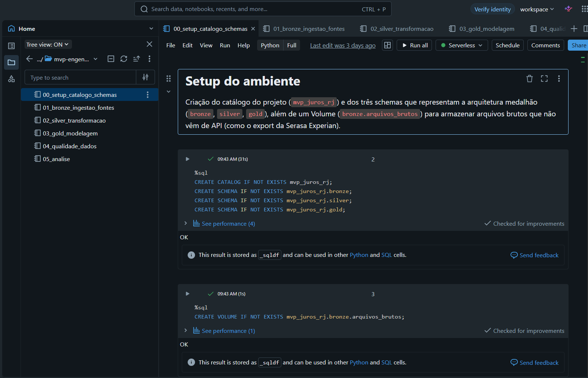

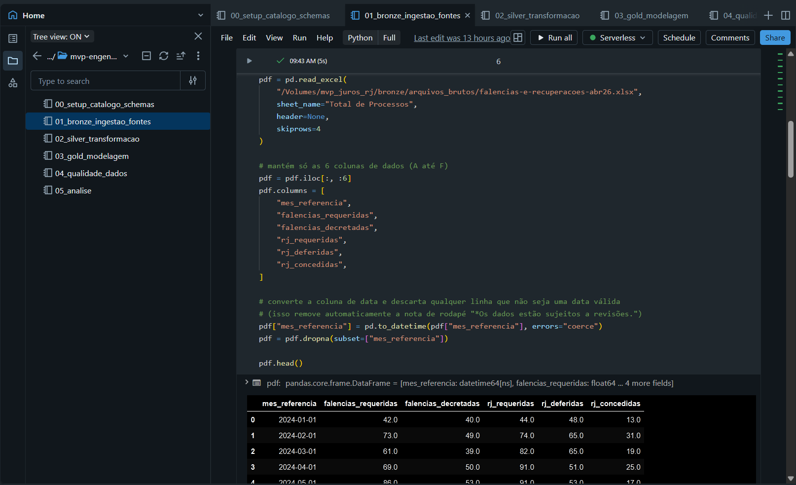

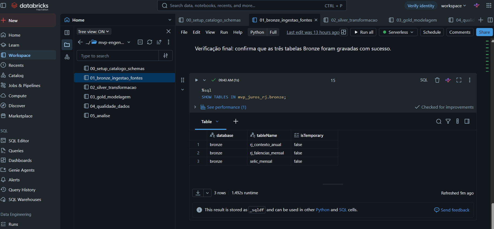

---

## Modelagem e Catálogo de Dados

*(Referência ao enunciado do MVP: Etapa 4.3)*

O modelo segue um Esquema Estrela enxuto, pensado para o nível de agregação real dos dados disponíveis:

- **`gold.dim_tempo`**: dimensão de tempo, construída a partir do grão real do projeto (os 28 meses de jan/2024 a abr/2026, definidos pela tabela de RJ, não pela série mais longa da Selic). Contém `mes_referencia`, `ano`, `trimestre` e `nome_mes`.
- **`gold.fato_indicadores_mensais`**: fato principal, no grão de um mês. Junta `silver.selic_mensal` com `silver.rj_falencias_mensal` pela chave de mês. Alimenta a Pergunta 1.
- **`gold.fato_contexto_anual`**: fato secundário, no grão de um ano. É praticamente uma promoção direta da camada Silver, sem junções. Alimenta a Pergunta 2.

Duas decisões de modelagem valem ser explicadas:

**Por que não existe uma segunda dimensão (por setor, por porte de empresa)?** Porque os dados disponíveis, tanto da Selic quanto do export da Serasa, vêm agregados no nível de país por mês, sem esse detalhe. O modelo é enxuto porque a fonte é agregada, não porque foi simplificado à toa.

**Por que `fato_contexto_anual` não tem uma dimensão própria de tempo?** Porque `ano` é só um número solto, sem atributos descritivos adicionais que justificassem criar uma tabela separada para ele. Ele funciona como o que se chama de dimensão degenerada: uma coluna que tecnicamente é uma dimensão, mas não precisa de tabela própria. Além disso, `fato_indicadores_mensais` e `fato_contexto_anual` têm grãos diferentes (mês e ano) e usam metodologias diferentes de origem, então forçá-los a compartilhar uma dimensão de tempo só traria complexidade sem ganho real.

### Catálogo de dados

**`gold.dim_tempo`**

| Coluna | Tipo | Descrição | Domínio |
|---|---|---|---|
| `mes_referencia` | date | Mês de referência, chave da dimensão | jan/2024 a abr/2026 |
| `ano` | int | Ano derivado de `mes_referencia` | 2024, 2025, 2026 |
| `trimestre` | int | Trimestre do ano, derivado de `mes_referencia` | 1 a 4 |
| `nome_mes` | string | Nome do mês por extenso, derivado de `mes_referencia` | January a December |

**`gold.fato_indicadores_mensais`**

| Coluna | Tipo | Descrição | Domínio |
|---|---|---|---|
| `mes_referencia` | date | Mês de referência | jan/2024 a abr/2026 |
| `selic_mensal_pct` | decimal(6,4) | Selic acumulada no mês, em % | aproximadamente 0,8 a 1,3 |
| `falencias_requeridas` | int | Pedidos de falência no mês | inteiro positivo |
| `falencias_decretadas` | int | Falências decretadas no mês | inteiro positivo |
| `rj_requeridas` | int | Pedidos de RJ requeridos no mês | inteiro positivo |
| `rj_deferidas` | int | Pedidos de RJ deferidos no mês | inteiro positivo |
| `rj_concedidas` | int | Recuperações judiciais concedidas no mês | inteiro positivo |

**`gold.fato_contexto_anual`**

| Coluna | Tipo | Descrição | Domínio |
|---|---|---|---|
| `ano` | int | Ano de referência | 2016 a 2024 |
| `pedidos_rj` | int | Total de pedidos de RJ no ano (metodologia anterior a 2026) | inteiro positivo |
| `selic_media_anual` | decimal(5,2) | Selic média do ano, em % | aproximadamente 2,8 a 14,1 |
| `tipo_valor` | string | Indica se o número veio direto de um comunicado (`primario`) ou foi calculado a partir de uma variação percentual (`estimado`) | primario, estimado |

**Evidências:**

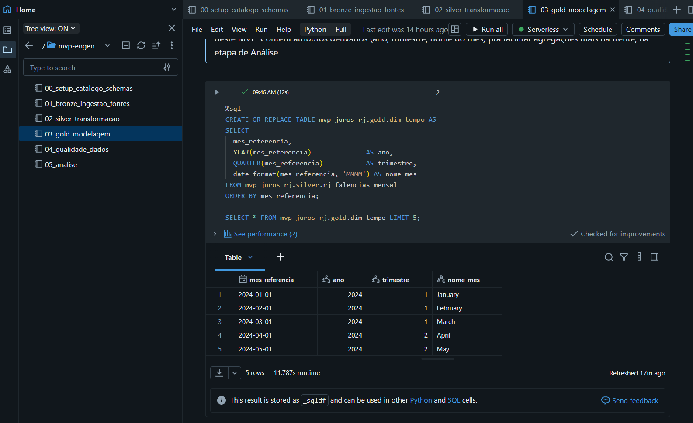

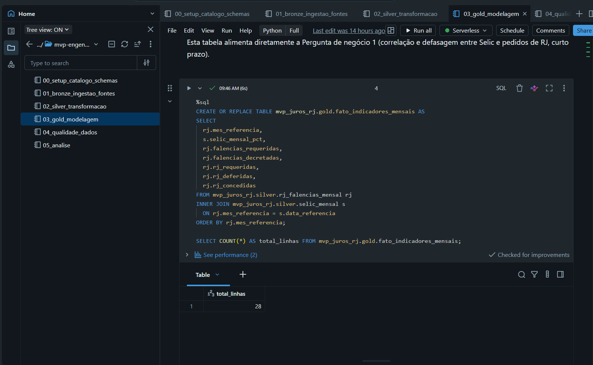

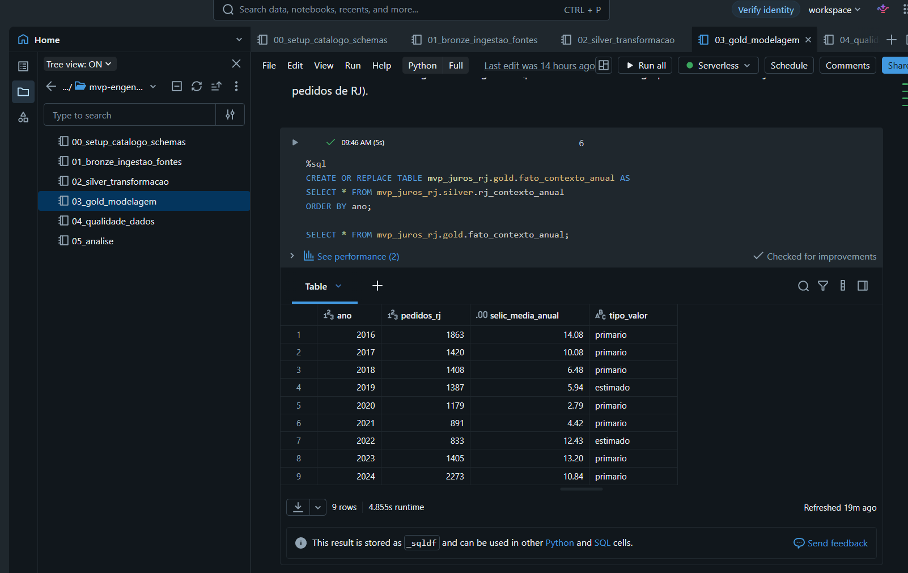

**Linhagem:** `dim_tempo` é derivada de `silver.rj_falencias_mensal`, usada como referência de grão porque define os 28 meses reais do projeto. `fato_indicadores_mensais` vem do cruzamento de `silver.selic_mensal` (que vem de `bronze.selic_mensal`, carregada da API do BCB) com `silver.rj_falencias_mensal` (que vem de `bronze.rj_falencias_mensal`, carregada do export da Serasa). `fato_contexto_anual` vem de `silver.rj_contexto_anual`, que vem de `bronze.rj_contexto_anual`, compilada manualmente a partir de releases de imprensa.

---

## Pipeline de Dados

*(Referência ao enunciado do MVP: Etapa 4.4)*

O pipeline segue a arquitetura medalhão completa, em cinco notebooks:

| Notebook | Camada | Linguagem | O que faz |
|---|---|---|---|
| `00_setup_catalogo_schemas` | - | SQL | Cria o catálogo e os schemas bronze, silver e gold |
| `01_bronze_ingestao_fontes` | Bronze | Python (pandas/PySpark) | Ingestão das três fontes, sem transformação |
| `02_silver_transformacao` | Silver | Python (PySpark) | Limpeza de tipos e tratamento de qualidade |
| `03_gold_modelagem` | Gold | SQL | Junções e modelagem em Esquema Estrela |
| `04_qualidade_dados` | - | SQL | Checagens de completude, unicidade, consistência, acurácia e outliers |
| `05_analise` | - | SQL | Resposta às duas perguntas de negócio |

A ingestão das três fontes na Bronze foi feita num único notebook, em blocos separados por fonte. As transformações foram feitas majoritariamente em PySpark, com SQL usado para operações de criação de schema e verificação de tabelas na Bronze e na Silver. Na Gold, na análise de qualidade e na análise final, optei por trabalhar direto em SQL, por ser mais direto para junções e agregações declarativas.

**Evidências da camada Silver:**

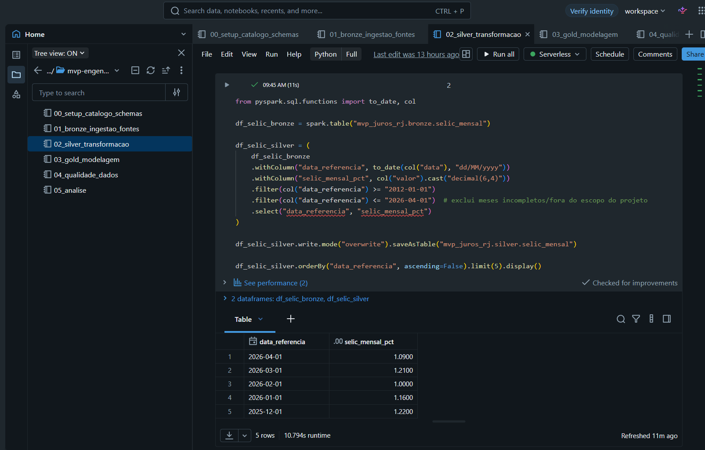

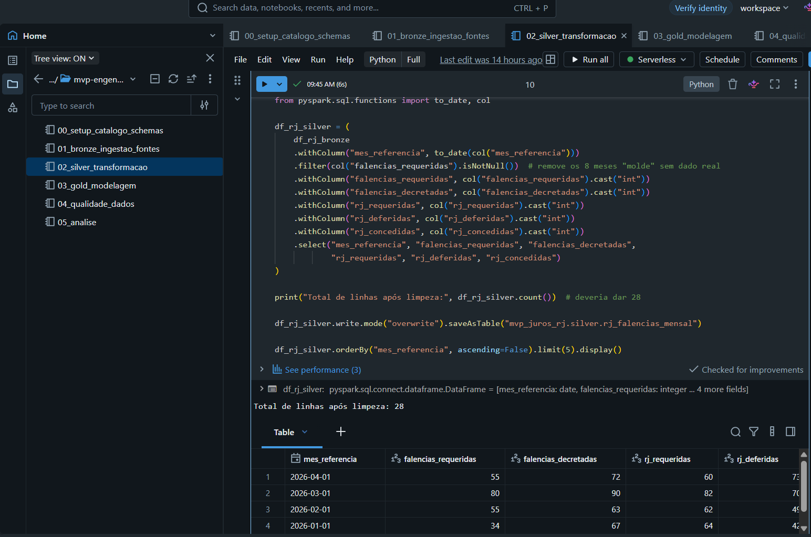

---

## Qualidade de Dados

*(Referência ao enunciado do MVP: Etapa 4.5)*

A checagem cobriu as cinco dimensões de qualidade recomendadas: completude, unicidade, consistência, acurácia e outliers, aplicadas às tabelas Gold.

| Dimensão | Resultado |
|---|---|
| Completude | Sem valores nulos em nenhuma das colunas numéricas |
| Unicidade | Sem meses ou anos duplicados |
| Consistência | Sem inconsistências reais (um falso positivo foi investigado e explicado, ver abaixo) |
| Acurácia | Domínio de `tipo_valor` correto; valores de Selic dentro da faixa esperada |
| Outliers | Dois identificados, não são erro, ver abaixo |

**Achados durante o processo:**

- Na Silver, o registro mais recente retornado pela API do BCB no momento da ingestão veio com valor de apenas 0,10%, muito abaixo do padrão mensal. Isso indicava um mês corrente incompleto, já que a Selic acumulada de um mês só fecha no final dele. Foi corrigido com um filtro de data, limitando a série ao fim da janela de análise do projeto.
- Também na Silver, a tabela de falências e RJ veio com 36 linhas em vez das 28 esperadas. Investigando, descobri que o arquivo de origem já vinha pré-formatado com linhas para meses futuros (até dezembro de 2026), todas com valores nulos, provavelmente um molde da planilha que a Serasa vai preenchendo mês a mês. Foi corrigido removendo as linhas nulas.
- Na etapa de Qualidade de Dados, uma checagem de consistência sinalizou 14 das 28 linhas por terem, num mesmo mês, mais casos deferidos ou decretados do que requeridos. Investigando, percebi que isso é esperado: os estágios de um processo judicial (requerimento, deferimento, concessão) não acontecem no mesmo mês, então um pedido requerido em um mês pode ser deferido só em outro. Confirmei isso comparando os totais acumulados do período inteiro, que seguem a ordem correta (requeridas maior ou igual a deferidas, que é maior ou igual a concedidas). Não era um erro no dado, era uma checagem mal desenhada da minha parte.
- Foram identificados dois outliers em `rj_requeridas`, no critério de mais de 2 desvios-padrão da média: janeiro de 2024 (44, o primeiro mês da série, com volume ainda baixo) e julho de 2025 (113, um dos picos observados na fase mais elevada da Selic dentro da janela). Nenhum dos dois indica erro, e ambos foram retomados na análise.

**Evidências:**

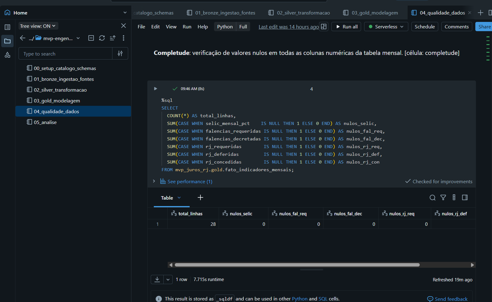

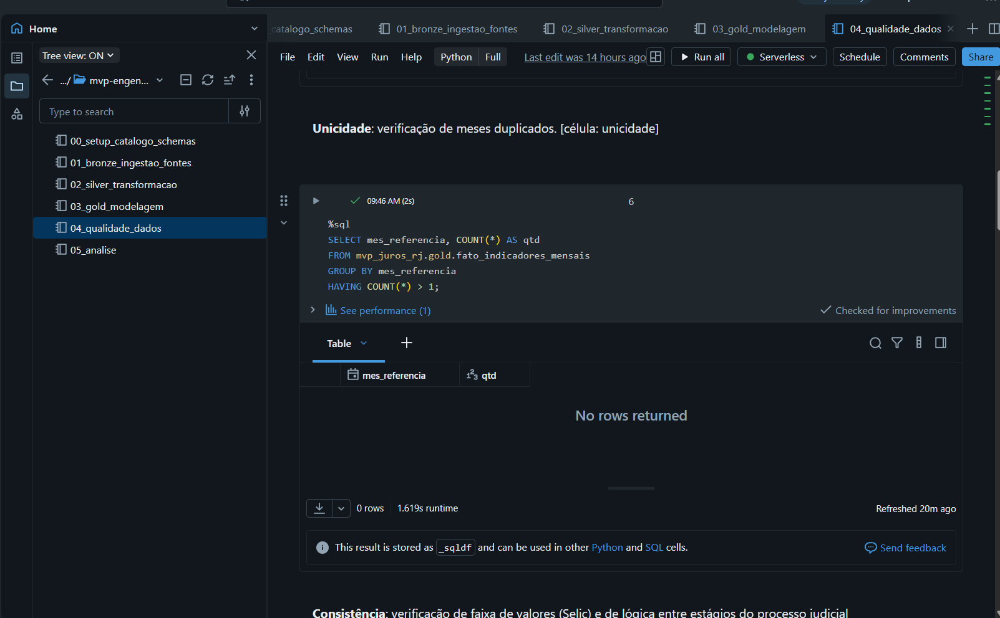

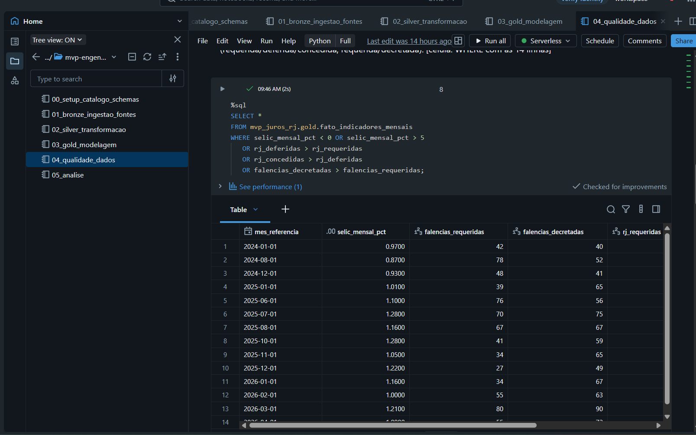

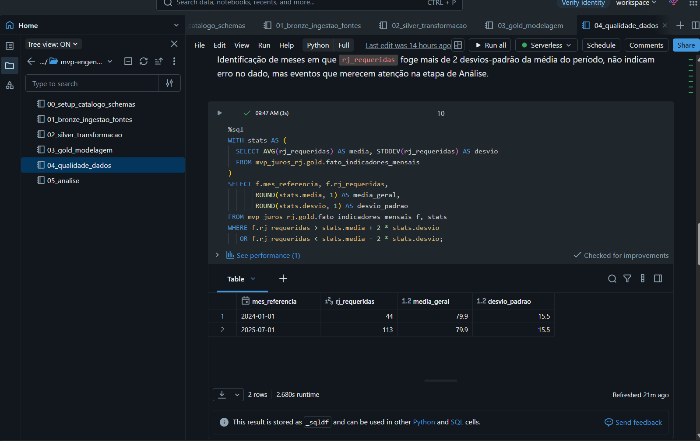

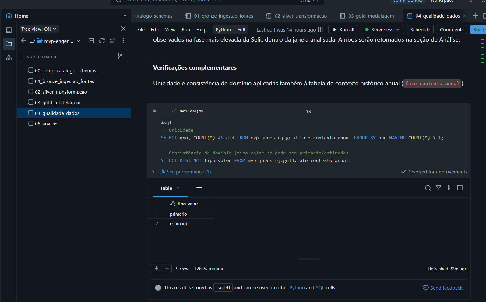

---

## Análise de Dados

*(Referência ao enunciado do MVP: Etapa 4.5)*

### Pergunta 1: correlação e defasagem (curto prazo, jan/2024 a abr/2026)

Calculei a correlação de Pearson entre a Selic mensal e os pedidos de RJ, sem defasagem e com defasagens de 1, 2, 3 e 6 meses. Os resultados ficaram fracos em todos os cenários: sem defasagem (r de aproximadamente 0,21), com 1 mês (0,01), 2 meses (0,04), 3 meses (-0,01) e 6 meses (-0,22, na direção oposta ao esperado). Com apenas 28 observações, nenhum desses coeficientes chega perto de ser estatisticamente significativo.

Isso sugere que o efeito da Selic sobre RJ, se existir, não aparece como uma resposta rápida mês a mês dentro de um período de pouco mais de dois anos.

**Evidências:**

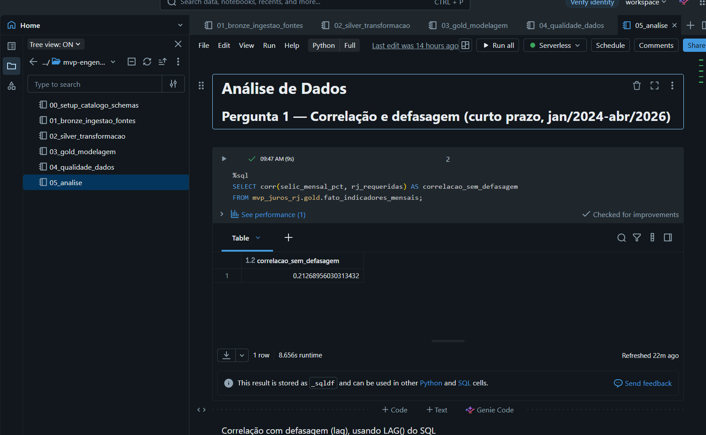

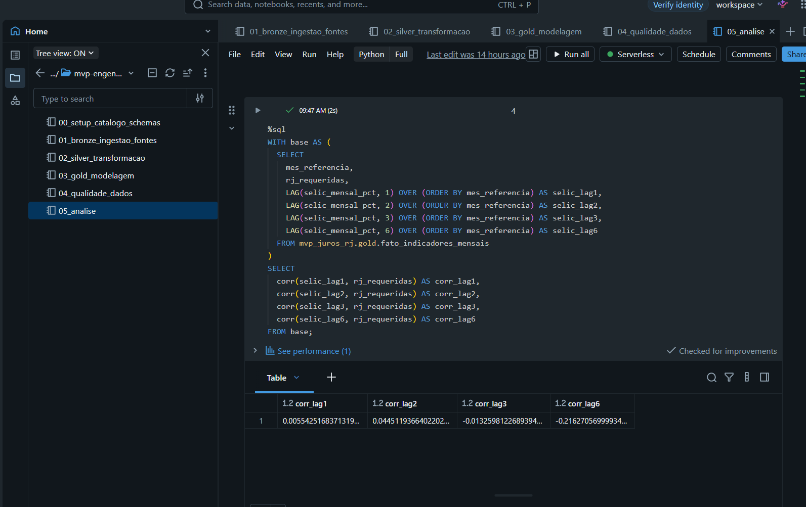

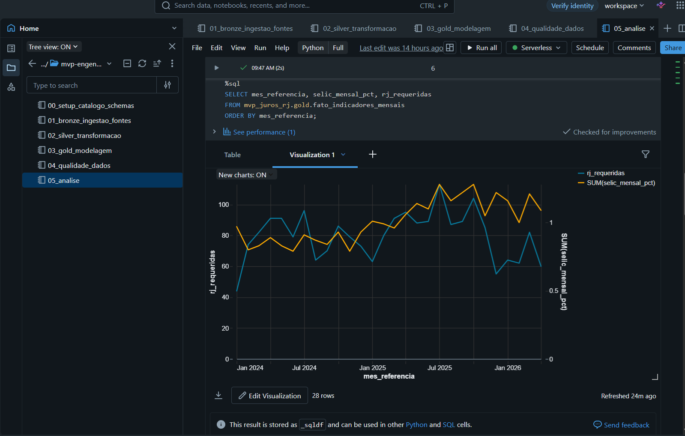

### Pergunta 2: padrão histórico (2016 a 2024, dados de contexto)

Comparei três períodos de três anos cada: 2016-2018 (juros altos, Selic média de 10,21%), 2019-2021 (juros baixos, Selic média de 4,38%) e 2022-2024 (juros altos de novo, Selic média de 12,16%). O volume médio anual de RJ seguiu o mesmo formato em "U": 1.564 no primeiro período, caindo para 1.152 no segundo, e subindo para 1.504 no terceiro, um aumento de 30,6% em relação ao período de juros baixos.

Um detalhe importante: a resposta não é imediata. Em 2022, já com Selic em 12,43%, o volume de RJ foi o menor de toda a série (833 pedidos). O aumento expressivo só apareceu em 2023 e 2024, o que sugere uma defasagem de 1 a 2 anos entre o início do ciclo de alta e a resposta em RJ. O mesmo parece valer no sentido inverso: a queda de RJ em 2019-2021 vem depois da queda de juros que já vinha desde 2017.

**Evidências:**

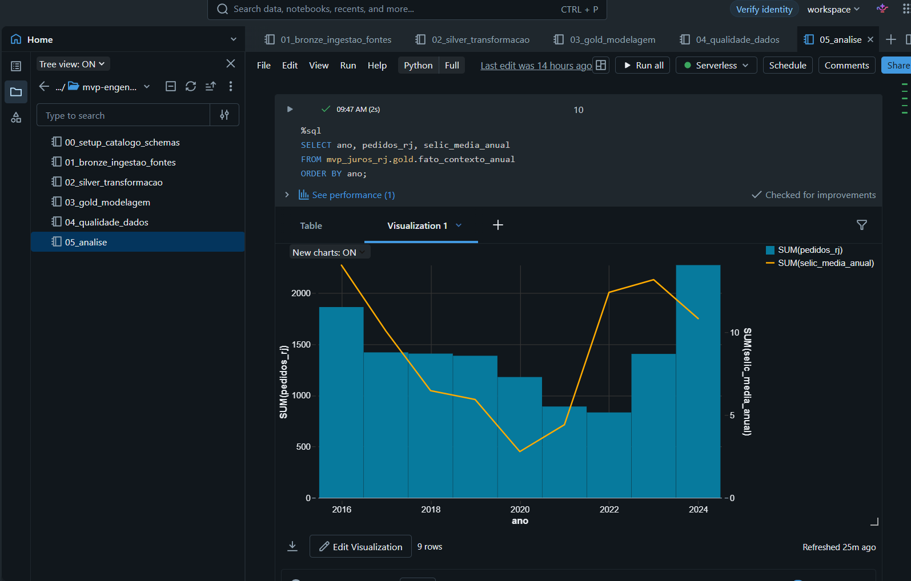

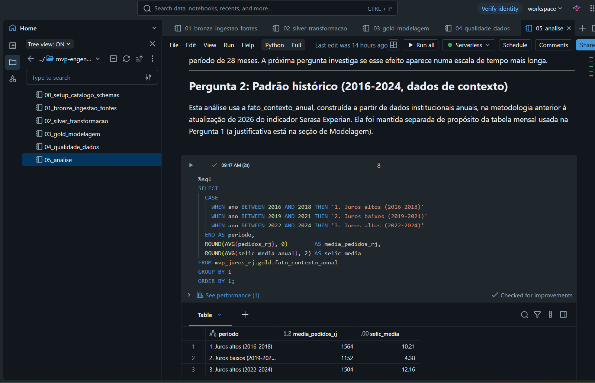

### Síntese geral

As duas perguntas, analisadas em escalas de tempo diferentes, contam histórias complementares. No curto prazo não há correlação forte entre Selic e RJ. No longo prazo aparece um padrão cíclico consistente com a hipótese de um efeito acumulado de juros elevados, com uma defasagem de 1 a 2 anos.

Esses dois resultados podem parecer contraditórios à primeira vista, mas acho que são o próprio achado deste projeto: se o efeito da Selic sobre recuperações judiciais existe, ele parece operar numa escala de tempo mais longa do que meses, e por isso não aparece num teste de curto prazo, mesmo estando presente quando se compara ciclos de vários anos.

A principal limitação é não conseguir testar essa defasagem de longo prazo com o mesmo rigor estatístico usado na análise mensal, já que a fonte anual segue uma metodologia diferente e tem granularidade mais grosseira. Um trabalho futuro poderia buscar uma fonte de dados judiciais mais granular e de longo prazo, como o CNJ/DataJud, testando essa defasagem com mais precisão e unificando as duas análises numa única série temporal contínua.

---

## Autoavaliação

Consegui atingir o objetivo principal do projeto, que era construir um pipeline de dados completo na nuvem, do problema até a resposta, e usar isso para investigar a relação entre juros e recuperação judicial de um jeito honesto, sem forçar uma conclusão que os dados não sustentassem.

A maior dificuldade não foi técnica, foi de dados: a fonte mensal com metodologia atual só cobre 28 meses, o que limitou bastante o que dava para testar estatisticamente no curto prazo. Resolvi isso complementando com uma série anual mais longa, de fonte diferente, mas isso trouxe outro desafio, que foi manter as duas análises honestas sobre suas próprias limitações em vez de misturar tudo numa conclusão só.

Também valeu a pena o tempo gasto questionando os próprios resultados das checagens de qualidade. A checagem de consistência que apontou 14 linhas problemáticas parecia um problema sério, mas era um erro na minha lógica de comparação, não no dado. Se eu tivesse aceitado o resultado sem investigar, teria documentado uma correção desnecessária.

Como trabalho futuro, ficaria a busca por uma fonte de dados judiciais mais granular e de mais longo prazo, como o CNJ/DataJud, que poderia permitir testar a hipótese de defasagem com mais rigor estatístico, e também a inclusão de uma dimensão setorial, que os dados atuais não permitem.
